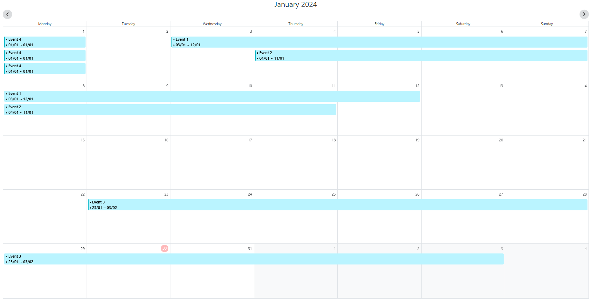
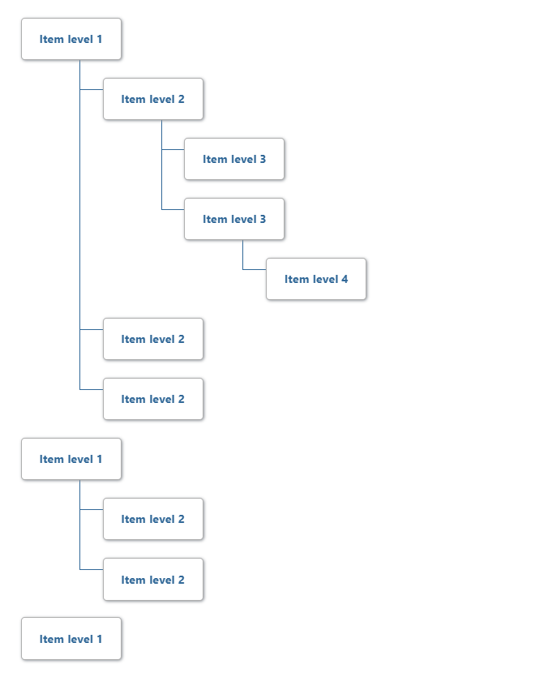

# SimpleComponents
[Simple Components](https://github.com/phamthehung-NET/SimpleComponents) is a collection of easy to use and implement [Razor components class libraries](https://learn.microsoft.com/en-us/aspnet/core/blazor/components/class-libraries?view=aspnetcore-7.0&tabs=visual-studio)

This project includes components:
* Calendar
* TreeView
* FolderView

# Features
### Calendar
* Display events on the grid
* Customize the event content
* Provide handling method when click to event on calendar
* Drag to select date range
* Provide handling method when user click to a date on grid
* Embedded data inside event
### Tree view
* Display a tree with item
* Customize each tree item content
* Provide handling method when click to item on tree
* Embedded data inside item
### Folder view
* Showing folders as folder tree
* Provide handling method when click to each folder
* Provide handling method drag and drop to move the folders and their children on folder tree (drag other item to folder will trigger this method as well)
* Embedded data inside folder

# Demo screenshot
### Calendar

### Horizontal Tree View

### Folder view


### Setup

Add reference to style sheet & javascript references
Add the following line to the head tag of your _Host.cshtml (Blazor Server).
(new update for .NET 8 - add import to App.razor file)
If you have already imported bootstrap v5.1 for your project, you can skip this step

#### Head Inclusions
```html
<link href="./_content/SimpleComponents/css/bootstrap.min.css" rel="stylesheet" />
```
##### Example: (head)
```html
    ....
    <link href="{YourBlazorProject}.styles.css" rel="stylesheet" />
    <link href="./_content/SimpleComponents/css/bootstrap.min.css" rel="stylesheet" />
</head>

```


Then add a reference to the Calendar JavaScript file at the bottom of the respective page after the reference to the Blazor file.
If you have already imported bootstrap v5.1 and jquery v3.7 into your project, you can skip this step
#### Body Inclusions
```html
<script src="./_content/SimpleComponents/js/bootstrap.bundle.js"></script>
<script src="./_content/SimpleComponents/js/jquery-3.7.0.min.js"></script>
```

##### Example: (body)
```html
    ....
    <script src="_framework/blazor.webassembly.js"></script>
    <script src="./_content/SimpleComponents/js/bootstrap.bundle.js"></script>
    <script src="./_content/SimpleComponents/js/jquery-3.7.0.min.js"></script>
</body>
```

### Usage
#### Calendar
SimpleComponents.Calendar will update the bound Events variable on change on the grid.

``` html
@page "/"

<SimpleComponents.Calendar T="ObjectDTO"
                    Context="Context"
                    Events="Events"
                    MinDate="DateTime.Now"
                    ShowedDate="new DateTime(DateTime.Now.Year, DateTime.Now.Month, 1)"
                    HighLightToday="true"
                    StartDayOfWeek="DayOfWeek.Monday">
</SimpleComponents.Calendar> 

<h2>@content</h2>

@code{
    private string content;
}
```

#### FolderView
SimpleComponents.FolderView will send the folder object data when you click to each folder on the tree view and collapse/expand folder at the same time

``` html
@page "/"

<FolderView T="ObjectDTO" Folders="FolderItems" />

<h2>@content</h2>

@code{
    private string content;
}
```

#### TreeView
SimpleComponents.TreeView will send the tree item data when you click to each item on the tree view

``` html
@page "/"

<TreeView T="ObjectDTO" TreeItems="TreeItems" />

<h2>@content</h2>

@code{
    private string content;
}
```

## ToDo
Add additional configuration.

Add new Components

Gives me some ideas about essential components will be developed in the future